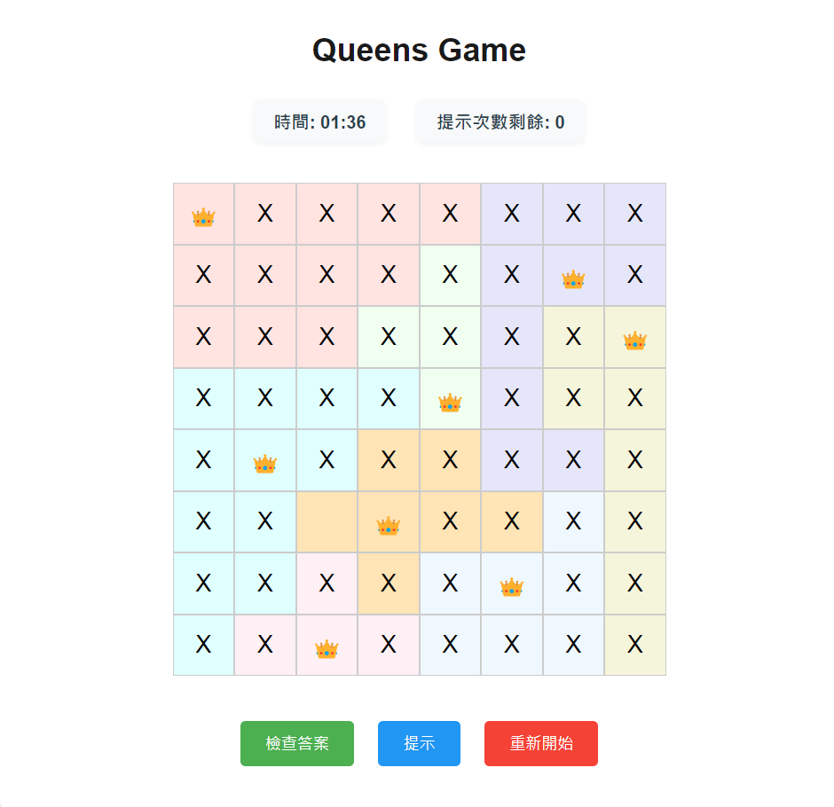
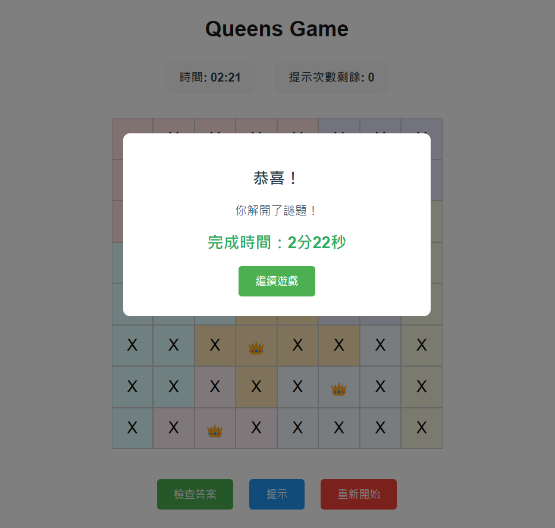

# 👑 Queens Game Puzzle

> 經典的皇后遊戲，考驗你的邏輯思維！

## ✨ 特色

- 🎮 直觀的點擊操作界面
- 🎯 智能生成的隨機謎題（保證有解）
- 🌈 清晰的顏色區域劃分
- ⏱️ 即時計時系統
- 💡 智能提示功能
- 🎨 現代化的UI設計
- 🔄 流暢的動畫效果

> 完成遊戲時的勝利畫面

## 🎯 遊戲規則

1. 每行只能放置一個皇后 (👑)
2. 每列只能放置一個皇后
3. 每個顏色區域只能放置一個皇后
4. 皇后之間不能相鄰（包括對角線）
5. 點擊一次放置 X，再次點擊放置皇后 (👑)

## 🛠️ 技術特點

- 使用 CoffeeScript 開發
- 模塊化的代碼結構
- 響應式設計
- 無需後端，純前端實現

## 🎮 功能

### 核心功能

- [X]  智能生成可解的遊戲板
- [X]  自動檢查解答正確性
- [X]  即時遊戲計時
- [X]  三次提示機會

### 操作功能

- [X]  單擊放置 X
- [X]  雙擊放置皇后
- [X]  第三次點擊清除
- [X]  一鍵重置遊戲

### 介面功能

- [X]  動畫提示效果
- [X]  優雅的完成彈窗
- [X]  即時遊戲狀態顯示
- [X]  友好的操作反饋

## 🚀 快速開始

1. 克隆專案：
   bash
   git clone https://github.com/jos556/.git
2. 安裝依賴：
   bash
   npm install
3. 編譯 CoffeeScript：
   bash
   npm run build

## 🤝 貢獻

歡迎提交 Issue 和 Pull Request！
